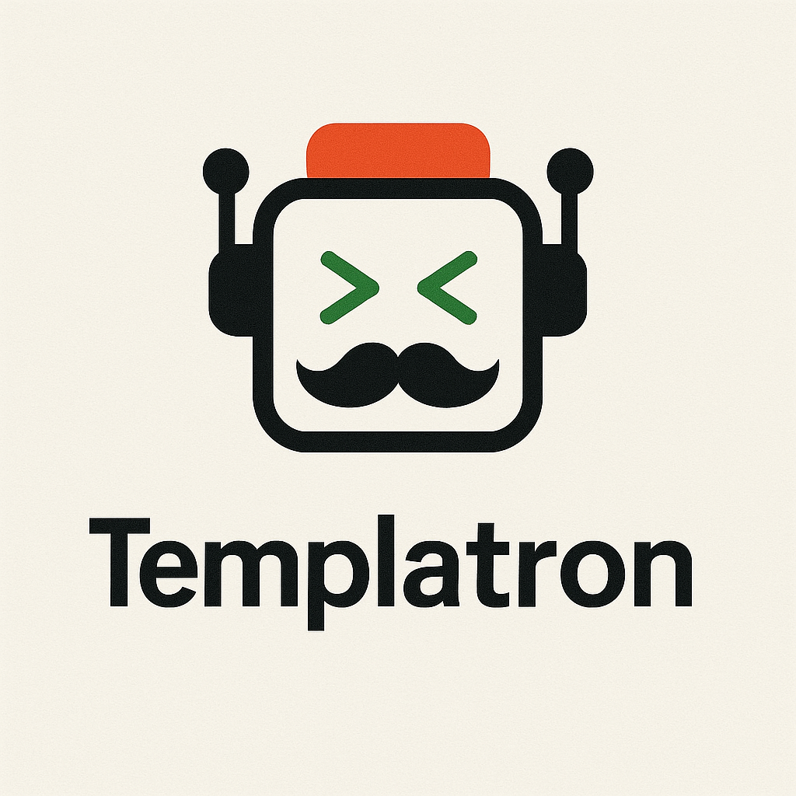

<p align="center"></p>

# Templatron: The generator that scaffold your own templates

(currently in beta)

---------

**Table of Contents**

- [Intro](#intro)
- [Installation](#installation)
  - [Global installation (recommended)](#global-installation-recommended)
  - [Local installation](#local-installation)
- [Initialize](#initialize)
  - [Templates folder](#templates-folder)
- [Create a new template](#create-a-new-template)
- [List templates](#list-templates)
- [Customize your templates](#customize-your-templates)
  - [Configuration File `config.mjs`](#configuration-file-configmjs)
  - [Template Files `.mustache`](#template-files-mustache)
    - [Mustache helpers](#mustache-helpers)
- [Remove a template](#remove-a-template)


---------

# Intro

As a developer, you often need to create new code files that comply with the project's code and architecture standards (e.g. components, utils, services, API models … etc.)

And often, other files are also required, such as styles, storybooks, tests, documentation…. Creating them by hand (or copy/paste and adapting them) can quickly become tedious.

That's why I've created **Templatron** : a tool that allows you to generate files from templates that YOU define.

**Templatron** is a simple CLI tool that will generate a couple of files based on templates (written in Mustache), and will ask you the right questions to generate only the files you need in your scenario.

See an example of execution :

https://github.com/user-attachments/assets/32d8e60d-4cad-4d60-8b22-237be8d050f1

# Installation

## Global installation (recommended)

You can install templatron globally:

```bash
npm i -g templatron
```

and then generate files from templates simply by running:

```bash
templatron <template_name> <name>
```

_(See ["Initialize"](#initialize) section below for more details about templates)_

## Local installation

If you prefer to install templatron locally in your project, you can do so by running:

```bash
npm i --save-dev templatron
```

… and then add a script to your `package.json`:

```json
// package.json
  "scripts": {
    "templatron": "templatron"
  }
```

The command will then be available in your project:

```bash
npm run templatron <template_name> <name>
```

# Initialize

`templatron` will basically need *templates* with configuration to know how to generate files.

A *template* is a folder that contains a `config.mjs` file and one or more `.mustache` files, for example :

```
~/.templatron
│
├── typescript_template
│   ├── config.mjs
│   ├── <% name %>.ts.mustache
│   └── <% name %>.spec.ts.mustache
│
└── php_template
    ├── config.mjs
    ├── <% name %>.class.php.mustache
    └── <% name %>.interface.php.mustache
```

Here you have two templates : **typescript_template** and **php_template** with their own configuration and files.

Markers `<% name %>` will be replaced by the name you'll choose when you'll run the CLI tool.

## Templates folder

All templates must be stored in a main folder named `.templatron`.

It can be located in your home directory (like `~/.templatron`), but also in your project's root directory (like `~/projects/my-project/.templatron`).

By default, the CLI tool will try to find the nearest `.templatron` folder from the current working directory (like `npm` does with `node_modules`).

This behavior adds a lot of flexibility, as you can have different templates for different projects 🎉

If this is your first time with Templatron, you can initialize a `.templatron` folder with an example template juste by running :

```bash
templatron
```

https://github.com/user-attachments/assets/f1e1d389-77a8-4c0b-a33c-96c96672486a

Feel free to explore the [example template](./template_example/) and its configuration file to understand how it works.

Continue to the [Customize your templates](#customize-your-templates) section below to learn how to create your own templates.

# Create a new template

To create a new template, you can use the `templatron --create <template_name>` command.

```bash
templatron --create <template_name>
```

This will create a new template in the current working directory.

# List templates

To list all templates, you can use the `templatron --list` command.

```bash
templatron --list
```

This will list all templates in the current working directory.


# Customize your templates

At this point, you know that templates are just folders located in a `.templatron` directory.

Example:

```
~/.templatron
└── foo
    ├── config.mjs
    ├── <% name %>.ts.mustache
    ├── <% name %>.spec.ts.mustache
    └── …
```

When you run `templatron foo Bar`, it will :

- search for the `foo` template in the `.templatron` directory and read the configuration file
- use `Bar` as the name to use for the tag `<% name %>` in the files name and also `.mustache` files

The files will then be generated depending on the configuration file, for example here :

- `Bar.ts`
- `Bar.spec.ts`

## Configuration File `config.mjs`

The `config.mjs` file must export a default configuration object with the following properties:

```js
export default {
  filesToGenerate: [
    // MANDATORY : This 1st file will always be generated
    {
      templateFileName: '<% name %>.ts.mustache',
    },
    // Yes/No questions ...
    {
      question: 'Generate spec file?',
      varName: 'spec',
      templateFileName: '<% name %>.spec.ts.mustache',
    },
    // ...
  ],
}
```

- `filesToGenerate`: an array of files to generate

The first object in the array **will always be generated**, and should **only contain** the `templateFileName` property.

The following objects will be generated if the confirmation question is validated by the user. The answer to the question is stored in the `varName` property of the configuration file, to be used in the `.mustache` templates.

- `question`: the question to ask the user
- `varName`: the name of the variable to store the answer in
- `templateFileName`: (optional) the name of the file to generate if the question is answered with "Yes"

## Template Files `.mustache`

Template files are compiled using [Mustache.js](https://github.com/janl/mustache.js).

After you answered the Yes/No questions, each file will receives an object with the following view:

```js
{
  name: "Bar", // The name of the file to generate

  // varName "spec"
  spec: { yes: true, no: false }, // Based on user's answer

  // …
}
```

The content of each `.mustache` file can thus read the value of `name` and `spec` to choose the code to generate.

For example :

```mustache
<%# spec.yes %>
// This will be present only if user answered "Yes" to the "spec" question
<%/ spec.yes %>

<#% spec.no %>
// This will be present only if user answered "No" to the "spec" question
<#/ spec.no %>

const <% name %> = "Hello World!"

// Rest of file to be generated …
```

If you invoked the command `templatron foo Bar` and chose "No" for the "spec" question, then the generated file would be:

```ts
// This will be present only if user answered "No" to the "spec" question

const Bar = 'Hello World!'

// Rest of file to be generated …
```

### Mustache helpers

By default, Templatron assumes that the name of the element you will use is written in PascalCase :

```bash
templatron example MyExampleComponent
```

If you want to use a different case inside `.mustache` templates, you can use a list of different helpers to convert the name to the desired case :

#### `toKebabCase`

Convert a string to kebab case, assuming the name is `"MyExampleComponent"` :

```mustache
.<%# toKebabCase %><% name %><%/ toKebabCase %> {
  box-sizing: border-box;
}
```

will generate :

```css
.my-example-component {
  box-sizing: border-box;
}
```

#### `toSnakeCase`

Convert a string to snake case, assuming the name is `"MyExampleComponent"` :

```mustache
from django.urls import path
from . import views
urlpatterns=[
  path('<%# toSnakeCase %><% name %><%/ toSnakeCase %>',views.home,name='<%# toSnakeCase %><% name %><%/ toSnakeCase %>'),
]
```

will generate :

```python
from django.urls import path
from . import views
urlpatterns=[
  path('my_example_component',views.home,name='my_example_component'),
]
```

#### `toCamelCase`

Convert a string to camel case, assuming the name is `"MyExampleComponent"` :

```mustache
const <%# toCamelCase %><% name %><%/ toCamelCase %> = "Hello World!"
```

will generate :

```js
const myExampleComponent = "Hello World!"
```

#### `toUppercase`

Convert a string to uppercase, assuming the name is `"MyExampleComponent"` :

```mustache
const <%# toUppercase %><% name %><%/ toUppercase %> = "Hello World!"
```

will generate :

```js
const MYEXAMPLECOMPONENT = "Hello World!"
```

#### `toLowerCase`

Convert a string to lowercase, assuming the name is `"MyExampleComponent"` :

```mustache
const <%# toLowerCase %><% name %><%/ toLowerCase %> = "Hello World!"
```

will generate :

```js
const myexamplecomponent = "Hello World!"
```

# Remove a template

To remove a template, you can use the `templatron --remove <template_name>` command.

```bash
templatron --remove <template_name>
```

This will remove the template from the current working directory.
